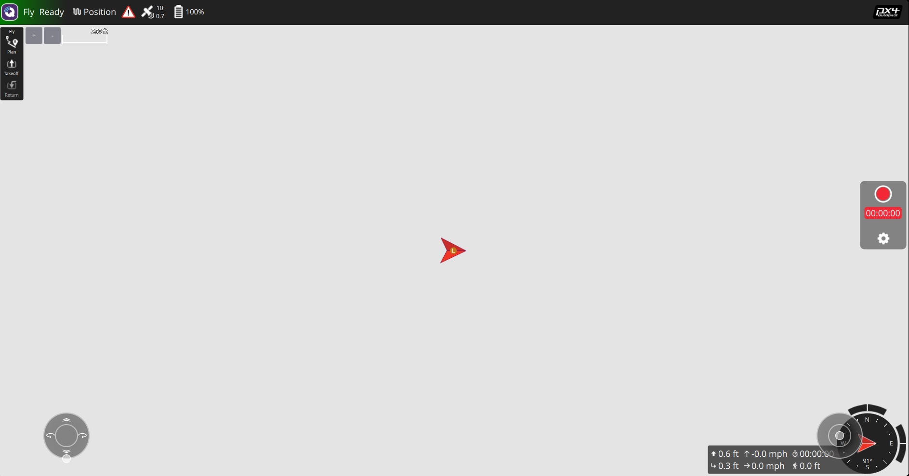

# PX4 Space System docker container

## Overview

This docker file is used as a way to containerize the simulation environment of PX4 space systems. The simulation run in Ubuntu 22.04 container and uses the new gazebo garden as a simulation engine.
Even tho the work is containerized, you still need to clone the repository to your own computer, since it is easier to work with shared folders, rather than cloning the repository to inside the docker.

If it is intended to use with ROS (inside the container) you should use ROS2 humble.

## Software packed inside

Inside the container you have packed Gazebo Garden, ros2 humble, micro ros agent, px4 msgs, qt version 6.6.3 and QGroundControl (with custom plugin for gz-sim7).

## Compiling

Compiling the docker is rather simple you must ensure that you have [docker installed](https://docs.docker.com/engine/install/) and that your version of docker already has the compose command available, this can be done simply by executing the command `docker compose version`, the output should be something similar to `Docker Compose version v2.36.2`

In order to build the image, you only need to do `docker compose build`, there is no longer the necessity to change any parameter regarding branch and repository link, since now the PX4 software used will be passed as a shared folder to the container. **Be aware this stage is extremely long, as well as resource intensive, in the laptop where the docker was created 32GB of ram were necessary, and the process to up to 40 minutes**

## Adding new shared folder

If there is a necessity to add more shared folders to the container, you only need change the `docker-compose.yml`, bellow the volumes section of the file add the new folder, currently if looks like this

```
    volumes:
      - /tmp/.X11-unix:/tmp/.X11-unix:rw
      - /dev/dri:/dev/dri
      - ../../PX4-Space-Systems:/home/px4space/PX4/PX4-Space-Systems
```

For the new folder simply add a new entry like this, take into consideration the formatting of the yaml file, otherwise it may not work, also the path in the root system can be either full path, or relative path, as long as the relative path is relative to the folder where the `docker-compose.yml` file is located at. Take into consideration the use of full path is not recommended, since other people may not have these folder in the same location.

```
      - ./path/to/folder/on/root/system:/path/to/folder/on/docker/container
```

## Running the container

Now that the container is build, you only need to run it, to do this, do `docker compose up -d` in a terminal in the same folder as where you have both the compose and Dockerfile, this runs the container in detached mode, allowing you to still use this terminal.

Now to get a terminal to run inside the container, simply run `docker exec -it px4_cont bash`, and you will have available a bash terminal in which you can run you code if necessery.

This container was developed around people using NVIDIA GPUS, so the instructions will not contain information for other gpu, but my best guess, will be removing all mention of nvidia and gpu in the `docker-compose.yml` file, but please this may not work as expected.

### First time running.

Since now we forward the **PX4-Space-Systems** folder to the docker container, the first time running the docker some actions are required, you will need to install all the dependencies as well as compile the contents of the repository. To this simply execute the next command.

```bash
pushd PX4/PX4-Space-Systems && \
	sudo chmod +x ./Tools/setup/ubuntu.sh && \
  sudo ./Tools/setup/ubuntu.sh -y && \
	pip3 install -r Tools/setup/requirements.txt && \
  pip3 install -r Tools/setup/optional-requirements.txt && \
	make px4_sitl && \
	popd

pushd $home/PX4/ros2_ws && \
  source  /opt/ros/humble/setup.bash && \
  source $home/Gazebo/install/setup.sh && \
  colcon build  --symlink-install --packages-select px4_msgs ros_gz_interfaces ros_gz_bridge
```

## Running simple simulation

After this the container should be ready to use with the normal functionalities of the simulation tool, to test run the following command in a terminal of the container

```bash
make px4_sitl gz_x500
```

And verify if a gazebo window opens with the x_500 robot in the simulation environment. Now open QGroundControl, to do this, simply open a new terminal and execute the following command `./QGroundControlApp`, in the application setting add joystick **for some reason the maps of QGroundControl are not working inside docker, this is a work in progress** so it should look like this.



Now simply arm the vehicle, and push the left joystick up, after this, you should start to se the propeller in the Gazebo spinning, and eventually a liftoff of the plane

## Running more complex simulation

This simulation already involves the use of some ros nodes (Dont worry, ros2 - humble is already installed in the container)

Start the gazebo environment with the space cobot robot

```
make px4_sitl gz_space_cobot
```

In another terminal start the micro_ros_agent (bridge gz topic to ros2)

```
ros2 run micro_ros_agent micro_ros_agent udp4 --port 8888
```

Now start the the Gz bridge, this node is a custom ros2 node that is available in [Github](https://github.com/Planning-and-Control-in-Space-Cobot/ros2), this will bridge the topic gazebo topic where the space cobot is expecting the control signal to ros2 in order to control only from a node, compile and launch the node using the following instructions

```
pushd cobotGazeboUtils/ros2_ws_px4
colcon build --symlink-install
source install/setup.bash
ros2 launch gz_bridge gz_bridge.launch.py
popd
```

Now simply put the robot in offboard mode, to this either use QGroundControl and create a ros2 node that populated the offboard mode heart beat signal, or use a node available [same Github previously cloned](https://github.com/Planning-and-Control-in-Space-Cobot/ros2). Compile and run the node using the following instructions

```
pushd cobotGazeboUtils/ros2_ws_cobot
colcon build --symlink-install
source install/setup.bash
ros2 run OffBoardModeGazebo OffBoardModeGazebo
popd
```

Now everything is ready to start controlling the robot, simply open a new terminal and run the following instruction

```
ros2 topic pub /space_cobot_0/motor_command actuator_msgs/msg/Actuators "{
  header: {
    stamp: {sec: 0, nanosec: 0},
    frame_id: ''
  },
  position: [],
  velocity: [1500.0, 1500.0, 1500.0, 1500.0, 1500.0, 1500.0],
  normalized: []
}"
```

## Problems

### Known problems

- [ ] QGround Control does not have a map image
- [ ] Having to use 'docker exec ...' to launch a terminal instead of having a service in `docker-compose.yml`

### Unknown problems

All problems that are not yet mentioned in the previous section, please open an issue in this [github](https://github.com/SpaceBotsISR/PX4-Space-Systems), make sure the instructions in the issue are sufficient to reproduce the issue in another machine, and assigned the issue to (andre-rebelo-teixeira) \*\*Observation: this should only be done if the issue is related to the docker container, and not any software such as Gazebo, PX4, QGroundControl, that should be handled with the respective maintainers, meaning if the problems exists both inside and outside of the docker container find the correct people to ask for help
